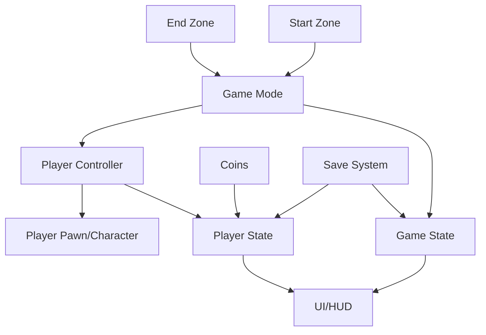
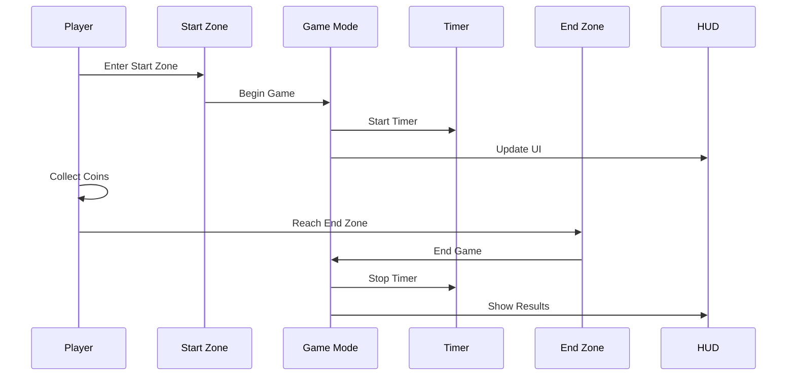

import { Callout, Steps, Tabs } from 'nextra/components'
import dynamic from 'next/dynamic'

export const LinkCard = dynamic(
  () => import('../../../components/LinkCard').then(mod => mod.LinkCard),
  { ssr: false }
)

export const LinkCards = dynamic(
  () => import('../../../components/LinkCard').then(mod => mod.LinkCards),
  { ssr: false }
)

# 🎮 점프맵 게임모드 완전 구현 가이드

<Callout type="success" emoji="🚀">
  언리얼 엔진 5에서 완벽한 점프맵 게임을 만들기 위한 단계별 가이드입니다.
  게임모드, 플레이어 시스템, UI, 세이브 기능까지 모든 것을 다룹니다.
</Callout>

## 📋 시스템 구조 개요

점프맵 게임의 전체 아키텍처와 각 컴포넌트의 역할을 이해합니다.

### 게임 구조도



### 핵심 컴포넌트

<LinkCards>
  <LinkCard
    title="게임모드 & 게임스테이트"
    description="게임 규칙, 시간 관리, 순위 시스템 구현"
    href="/unreal-engine-5/jumpmap-gamemode/game-mode"
    icon="🎯"
  />
  <LinkCard
    title="플레이어 컨트롤러 & 스테이트"
    description="입력 처리, 플레이어 데이터 관리"
    href="/unreal-engine-5/jumpmap-gamemode/player-controller"
    icon="🎮"
  />
  <LinkCard
    title="게임 액터 구현"
    description="시작 지점, 종료 지점, 코인 시스템"
    href="/unreal-engine-5/jumpmap-gamemode/actors"
    icon="⭐"
  />
  <LinkCard
    title="UI/HUD 시스템"
    description="시간, 점수, 순위표 표시"
    href="/unreal-engine-5/jumpmap-gamemode/ui-system"
    icon="📊"
  />
  <LinkCard
    title="세이브 시스템"
    description="게임 진행 상황 저장 및 불러오기"
    href="/unreal-engine-5/jumpmap-gamemode/save-system"
    icon="💾"
  />
  <LinkCard
    title="추가 기능"
    description="파워업, 업적, 멀티플레이어 등"
    href="/unreal-engine-5/jumpmap-gamemode/advanced"
    icon="✨"
  />
</LinkCards>

## 🎯 학습 목표

이 가이드를 완료하면 다음을 할 수 있습니다:

- ✅ 완전한 게임 모드 시스템 구축
- ✅ 플레이어 진행 상황 추적 및 저장
- ✅ 실시간 UI 업데이트 구현
- ✅ 순위표 및 리더보드 시스템
- ✅ 코인 수집 및 보상 시스템
- ✅ 게임 상태 저장 및 불러오기

## 🚀 시작하기 전에

### 필요한 사전 지식

<Callout type="info" emoji="📚">
  이 가이드를 따라하기 위해서는 다음 내용을 알고 있어야 합니다:
</Callout>

- 언리얼 엔진 5 기본 인터페이스
- 블루프린트 노드 시스템 기초
- 액터와 컴포넌트 개념
- 기본적인 게임 로직 이해

### 프로젝트 설정

<Steps>

### 새 프로젝트 생성

1. **Third Person** 템플릿 선택
2. **Blueprint** 프로젝트로 설정
3. 프로젝트 이름: `JumpMapGame`

### 폴더 구조 만들기

Content Browser에서 다음 폴더 구조 생성:

```plaintext
Content/
├── Blueprints/
│   ├── GameMode/
│   ├── Player/
│   ├── Actors/
│   └── UI/
├── Maps/
├── Materials/
└── Sounds/
```

### 기본 맵 설정

1. 새 레벨 생성: `JumpMap_Main`
2. 기본 라이팅 설정
3. 플레이어 스타트 포인트 배치

</Steps>

## 📊 게임 플로우

### 전체 게임 진행 과정



## 🎮 구현 순서

최적의 학습을 위한 권장 구현 순서입니다:

<Tabs items={['초급', '중급', '고급']}>
  <Tabs.Tab>
    **초급 - 기본 시스템**
    
    1. Game Mode 생성 및 기본 설정
    2. Player Controller 구현
    3. Start/End Zone 액터 생성
    4. 기본 HUD 위젯 제작
    5. 타이머 시스템 구현
  </Tabs.Tab>
  
  <Tabs.Tab>
    **중급 - 확장 기능**
    
    1. Player State로 데이터 관리
    2. Game State로 전역 상태 관리
    3. 코인 수집 시스템
    4. 세이브/로드 기능
    5. 순위표 시스템
  </Tabs.Tab>
  
  <Tabs.Tab>
    **고급 - 완성도**
    
    1. 파워업 시스템
    2. 업적 시스템
    3. 리플레이 기능
    4. 멀티플레이어 지원
    5. 스팀 연동
  </Tabs.Tab>
</Tabs>

## 💡 핵심 개념 이해

### Game Mode vs Game State

<Callout type="info">
  **Game Mode**: 게임의 규칙을 정의 (서버에만 존재)
  **Game State**: 게임의 현재 상태를 저장 (모든 클라이언트에 복제)
</Callout>

### Player Controller vs Player State

<Callout type="info">
  **Player Controller**: 입력 처리 및 플레이어 제어
  **Player State**: 플레이어별 데이터 저장 (점수, 이름 등)
</Callout>

## 🔧 개발 팁

### 효율적인 작업 방법

1. **반복 테스트**: 각 기능을 구현할 때마다 즉시 테스트
2. **버전 관리**: Git을 사용하여 진행 상황 저장
3. **주석 작성**: 블루프린트에 Comment 노드 활용
4. **모듈화**: 재사용 가능한 컴포넌트로 분리

### 일반적인 문제 해결

<Callout type="warning" emoji="⚠️">
  **자주 발생하는 문제들:**
  - Game Mode가 적용되지 않음 → World Settings 확인
  - UI가 표시되지 않음 → Z-Order 및 Visibility 확인
  - 타이머가 작동하지 않음 → Tick 이벤트 활성화 확인
</Callout>

## 📚 추가 리소스

### 유용한 링크

- [언리얼 엔진 공식 문서](https://docs.unrealengine.com)
- [블루프린트 베스트 프랙티스](https://docs.unrealengine.com/5.0/en-US/blueprint-best-practices-in-unreal-engine/)
- [게임모드 프레임워크](https://docs.unrealengine.com/5.0/en-US/game-mode-and-game-state-in-unreal-engine/)

### 커뮤니티

- [언리얼 엔진 포럼](https://forums.unrealengine.com)
- [Reddit r/unrealengine](https://www.reddit.com/r/unrealengine/)
- [Discord 언리얼 슬래커스](https://discord.gg/unreal-slackers)

## 🎯 다음 단계

이제 게임모드 구현을 시작할 준비가 되었습니다!

<Callout type="success" emoji="🚀">
  첫 번째 단계인 **게임모드 & 게임스테이트** 구현부터 시작하세요.
  각 섹션은 이전 섹션을 기반으로 하므로 순서대로 진행하는 것을 권장합니다.
</Callout>

[게임모드 구현 시작하기 →](/unreal-engine-5/jumpmap-gamemode/game-mode)