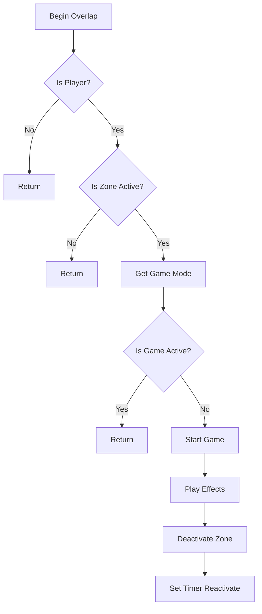

import { Callout, Steps, Tabs, Card } from 'nextra/components'
import { Play, Trophy, Coins, Sparkles } from 'lucide-react'
import { LinkCard } from '@/components/link-card'
import BlueprintExample_New from '@/components/blueprint-example-new'

# 🎯 게임 액터 구현 (Zones & Coins)

<Callout type="info" emoji="🎮">
게임의 핵심 상호작용 요소인 Start Zone, End Zone, Coin 액터를 구현합니다.
</Callout>

## 🚀 1. Start Zone (BP_StartZone)

### 액터 생성

<Steps>
### Blueprint 생성
1. Content Browser에서 우클릭
2. **Blueprint Class** → **Actor** 선택
3. 이름: `BP_StartZone`
4. 폴더: `Content/Blueprints/Actors/`

### 컴포넌트 구성
Components 패널에서 추가:
1. **Box Collision** - 트리거 영역
2. **Static Mesh** - 시각적 플랫폼
3. **Text Render** - "START" 텍스트
4. **Particle System** - 대기 이펙트
5. **Audio Component** - 환경음
</Steps>

### 컴포넌트 상세 설정

<Tabs items={['Box Collision', 'Static Mesh', 'Visual Effects', 'Audio']}>
  <Tabs.Tab>
```cpp
// Box Collision Component
Name: TriggerBox
Parent: DefaultSceneRoot

// Details Panel
Transform:
  Location: (0, 0, 100)
  Scale: (4, 4, 2)  // 200x200x100 units

Shape:
  Box Extent: (100, 100, 50)

Collision:
  Collision Presets: Trigger
  Generate Overlap Events: True
  
Rendering:
  Hidden in Game: False (디버그용)
  Rendering → Hidden in Game: True (최종)
```
  </Tabs.Tab>
  
  <Tabs.Tab>
```cpp
// Static Mesh Component
Name: PlatformMesh
Parent: DefaultSceneRoot

// Details Panel
Static Mesh: SM_Platform_Start
Materials:
  Element 0: M_StartPlatform
  
Transform:
  Location: (0, 0, 0)
  Scale: (2, 2, 0.2)

Collision:
  Collision Presets: BlockAll
```
  </Tabs.Tab>
  
  <Tabs.Tab>
```cpp
// Text Render Component
Name: StartText
Text: "START"
Font Size: 72
Text Material: M_EmissiveText
Horizontal Alignment: Center

// Particle System Component
Name: IdleEffect
Template: P_StartZone_Idle
Auto Activate: True
Location: (0, 0, 50)

// Spot Light Component (Optional)
Name: HighlightLight
Intensity: 2000
Light Color: (0, 1, 0)  // Green
Attenuation Radius: 500
```
  </Tabs.Tab>
  
  <Tabs.Tab>
```cpp
// Audio Component
Name: AmbientSound
Sound: S_StartZone_Ambient
Volume Multiplier: 0.5
Is UISound: False
Auto Activate: True
Attenuation Settings: AS_Zone_Attenuation
```
  </Tabs.Tab>
</Tabs>

### 변수 설정

```cpp
// === Configuration ===
bIsActive: Boolean = True           // Zone 활성 상태
ActivationDelay: Float = 0.5        // 재활성화 지연
RequiredPlayers: Integer = 1        // 필요한 플레이어 수

// === References ===
GameModeRef: GM_JumpMap             // Game Mode 참조
LastActivatedPlayer: Character      // 마지막 활성화 플레이어

// === Effects ===
StartEffectClass: ParticleSystem    // 시작 이펙트
StartSound: SoundBase                // 시작 사운드
```

### Event Graph 구현

#### BeginPlay

<div className="bg-gray-900 rounded-lg p-4 mt-4">
```blueprint
Event BeginPlay
│
├─ Get Game Mode → Cast to GM_JumpMap
│   └─ SET GameModeRef
│
├─ Register with GameMode
│   └─ GameMode->RegisterStartZone(Self)
│
└─ Setup Initial State
    ├─ Set Text Color (Green)
    └─ Play Idle Animation
```
</div>

#### OnComponentBeginOverlap



<div className="bg-gray-900 rounded-lg p-4 mt-4">
```blueprint
On Component Begin Overlap (TriggerBox)
│
├─ Cast to Character
│   └─ Failed → Return
│
├─ Branch: bIsActive?
│   └─ False → Return
│
├─ Get Game Mode (GameModeRef)
│   └─ Branch: bIsGameActive?
│       └─ True → Return (게임 이미 진행중)
│
├─ Start Game Sequence
│   ├─ Call GameMode->StartGame()
│   ├─ Store Player Reference
│   └─ Broadcast OnPlayerEntered
│
├─ Visual Effects
│   ├─ Spawn Emitter at Location (StartEffect)
│   ├─ Play Sound at Location (StartSound)
│   └─ Timeline: Pulse Platform
│
└─ Deactivate Zone (Temporarily)
    ├─ SET bIsActive = False
    ├─ Set Collision Enabled (No Collision)
    └─ Set Timer (ActivationDelay) → ReactivateZone
```
</div>

### Helper 함수

#### ReactivateZone

```cpp
Function ReactivateZone()
{
    bIsActive = True
    TriggerBox->SetCollisionEnabled(Query Only)
    
    // 시각적 피드백
    StartText->SetTextRenderColor(Green)
    PlayAnimation("ZoneReady")
}
```

## 🏆 2. End Zone (BP_EndZone)

### 컴포넌트 구성

```cpp
BP_EndZone (Actor)
├── DefaultSceneRoot
├── BoxCollision (트리거)
│   └── BoxExtent: (200, 200, 100)
├── StaticMesh (골 플랫폼)
│   └── Material: M_EndPlatform (Gold)
├── TextRender ("FINISH")
│   └── Font Size: 72
├── ParticleSystem (승리 준비 효과)
├── SpotLight (조명 효과)
│   └── Light Color: Gold
└── NiagaraSystem (불꽃놀이 - 비활성)
```

### 변수 설정

```cpp
// === Configuration ===
bIsActive: Boolean = True           // Zone 활성 상태
bRequireAllCoins: Boolean = False   // 모든 코인 필요 여부
MinimumCoins: Integer = 0           // 최소 필요 코인

// === References ===
GameModeRef: GM_JumpMap
GameStateRef: GS_JumpMap
WinnerPlayer: Character             // 승리한 플레이어

// === Effects ===
VictoryEffect: NiagaraSystem        // 승리 이펙트
VictorySound: SoundBase             // 승리 사운드
FireworksEffect: ParticleSystem     // 불꽃놀이
```

### Event Graph

#### OnComponentBeginOverlap

<div className="bg-gray-900 rounded-lg p-4 mt-4">
```blueprint
On Component Begin Overlap (BoxCollision)
│
├─[1] Validate Player
│     ├─ Cast to Character
│     └─ Get Player State → Cast to PS_JumpMap
│
├─[2] Check Game State
│     ├─ Get GameMode->bIsGameActive
│     └─ Branch: False → Return
│
├─[3] Check Requirements
│     ├─ Branch: bRequireAllCoins?
│     │   └─ Check PlayerState->CoinsCollected >= TotalCoins
│     └─ Branch: MinimumCoins > 0?
│         └─ Check PlayerState->CoinsCollected >= MinimumCoins
│
├─[4] Stop Timer
│     └─ GameState->StopTimer() → Get Final Time
│
├─[5] Calculate Final Score
│     ├─ Get Player Score
│     ├─ Get Time Bonus
│     └─ GameMode->CalculateFinalScore()
│
├─[6] Victory Sequence
│     ├─ Spawn Victory Effects
│     │   ├─ Niagara System (Fireworks)
│     │   ├─ Particle System (Confetti)
│     │   └─ Dynamic Light Flash
│     ├─ Play Victory Sound (3D)
│     ├─ Camera Shake (Victory)
│     └─ Slow Motion (0.3 for 2 seconds)
│
└─[7] End Game
      ├─ GameMode->EndGame(True)
      ├─ Store Winner Reference
      └─ Broadcast OnPlayerReached
```
</div>

### Victory Effects 구현

```cpp
Function TriggerVictoryEffects()
{
    // 1. 불꽃놀이 스폰
    for (i = 0; i < 5; i++)
    {
        RandomOffset = Random Vector in Cone(UpVector, 45°)
        Location = GetActorLocation() + (RandomOffset * 500)
        
        Spawn Niagara System at Location
        Set Timer (i * 0.5) → Spawn Firework
    }
    
    // 2. 카메라 효과
    Player Controller->Client Start Camera Shake(CS_Victory)
    
    // 3. 슬로우 모션
    Set Global Time Dilation(0.3)
    Set Timer (2.0) → Reset Time Dilation
    
    // 4. 사운드
    Play Sound at Location(VictorySound)
    
    // 5. UI 알림
    Show Victory Banner("VICTORY!")
}
```

## 💰 3. Coin Actor (BP_Coin)

### 컴포넌트 구성

<Tabs items={['Component Tree', 'Mesh Settings', 'Collision', 'Effects']}>
  <Tabs.Tab>
```cpp
BP_Coin (Actor)
├── DefaultSceneRoot
├── StaticMesh (코인 메시)
│   └── RotatingMovement Component
├── SphereCollision
│   └── Radius: 50
├── PointLight (광택 효과)
│   └── Intensity: 500
├── NiagaraSystem (반짝임)
│   └── Auto Activate: True
└── AudioComponent (대기음)
    └── Volume: 0.3
```
  </Tabs.Tab>
  
  <Tabs.Tab>
```cpp
// Static Mesh Component
Static Mesh: SM_Coin
Materials:
  Element 0: M_Coin_Gold
  
Transform:
  Scale: (1, 1, 1)
  
// Rotating Movement Component
Rotation Rate: (0, 180, 0)  // Y축 회전
Pivot Translation: (0, 0, 0)
```
  </Tabs.Tab>
  
  <Tabs.Tab>
```cpp
// Sphere Collision
Sphere Radius: 50
Collision Presets: OverlapOnlyPawn
Generate Overlap Events: True

// Collision Responses
WorldStatic: Ignore
WorldDynamic: Ignore
Pawn: Overlap
PhysicsBody: Ignore
Vehicle: Ignore
Destructible: Ignore
```
  </Tabs.Tab>
  
  <Tabs.Tab>
```cpp
// Point Light
Intensity: 500
Light Color: (1, 0.8, 0)  // Gold
Attenuation Radius: 150
Use Inverse Squared Falloff: True

// Niagara System
Asset: NS_Coin_Sparkle
Auto Activate: True
Location: (0, 0, 20)

// Collection Effect (별도)
CollectionEffect: NS_Coin_Collect
CollectionSound: S_Coin_Pickup
```
  </Tabs.Tab>
</Tabs>

### 변수 설정

```cpp
// === Core Variables ===
CoinValue: Integer = 100            // 코인 가치
bIsCollected: Boolean = False       // 수집 여부
CoinID: Integer = -1                 // 고유 ID (선택)

// === Respawn Settings ===
bCanRespawn: Boolean = False        // 리스폰 가능 여부
RespawnTime: Float = 10.0           // 리스폰 시간
RespawnTimerHandle: TimerHandle     

// === Effects ===
CollectEffect: ParticleSystem       // 수집 이펙트
CollectSound: SoundBase             // 수집 사운드
IdleEffect: NiagaraSystem           // 대기 이펙트

// === Animation ===
BobHeight: Float = 20.0             // 위아래 움직임
BobSpeed: Float = 2.0               // 움직임 속도
RotationSpeed: Float = 180.0        // 회전 속도
```

### Event Graph

#### BeginPlay

```cpp
Event BeginPlay
│
├─ Register with GameMode
│   └─ GameMode->RegisterCoin(Self)
│
├─ Setup Movement
│   ├─ Add Rotating Movement Component
│   └─ Set Rotation Rate (0, RotationSpeed, 0)
│
├─ Start Bobbing Animation
│   └─ Timeline: Bob Up and Down
│
└─ Setup Initial Effects
    ├─ Activate Idle Particle
    └─ Set Light Intensity
```

#### Overlap Event

<div className="bg-gray-900 rounded-lg p-4 mt-4">
```blueprint
On Component Begin Overlap (SphereCollision)
│
├─[1] Validation Checks
│     ├─ Branch: bIsCollected?
│     │   └─ True → Return
│     ├─ Cast to Character
│     └─ Get Player State → Cast to PS_JumpMap
│
├─[2] Add Score & Update Stats
│     ├─ PlayerState->CollectCoin(CoinValue)
│     └─ SET bIsCollected = True
│
├─[3] Collection Effects
│     ├─ Spawn Emitter at Location
│     │   ├─ Template: CollectEffect
│     │   └─ Scale: (1.5, 1.5, 1.5)
│     ├─ Play Sound at Location
│     │   ├─ Sound: CollectSound
│     │   └─ Volume: 1.0
│     └─ Play Haptic Feedback (Controller)
│
├─[4] Collection Animation
│     ├─ Timeline: Scale Down
│     │   ├─ 0.0s: Scale (1,1,1)
│     │   └─ 0.3s: Scale (0,0,0)
│     └─ Timeline: Move Up
│         ├─ 0.0s: Z+0
│         └─ 0.3s: Z+100
│
├─[5] Hide Coin
│     ├─ Set Actor Hidden in Game (True)
│     ├─ Set Collision Enabled (No Collision)
│     └─ Deactivate All Components
│
└─[6] Optional Respawn
      └─ Branch: bCanRespawn?
          └─ True → Set Timer (RespawnTime) → RespawnCoin
```
</div>

### Animation Timeline

#### Bobbing Animation

```cpp
Timeline: CoinBob
│
├─ Float Track: "Height"
│   ├─ 0.0s: 0.0
│   ├─ 0.5s: 1.0 (Ease In/Out)
│   ├─ 1.0s: 0.0
│   └─ Loop: True
│
└─ Update Event
    ├─ Get Timeline Value
    ├─ Lerp (0, BobHeight)
    └─ Set Relative Location Z
```

#### Collection Animation

```cpp
Timeline: CollectAnimation
│
├─ Float Track: "Scale"
│   ├─ 0.0s: 1.0
│   ├─ 0.15s: 1.3 (Bounce)
│   └─ 0.3s: 0.0
│
├─ Float Track: "Height"
│   ├─ 0.0s: 0.0
│   └─ 0.3s: 100.0
│
└─ Finished Event
    └─ Complete Collection
```

### Helper 함수

#### RespawnCoin

```cpp
Function RespawnCoin()
{
    // 상태 리셋
    bIsCollected = False
    
    // 컴포넌트 재활성화
    Set Actor Hidden in Game (False)
    Set Collision Enabled (Query Only)
    Activate All Components
    
    // 이펙트
    Spawn Emitter at Location (RespawnEffect)
    Play Sound at Location (RespawnSound)
    
    // 애니메이션 재시작
    Play Timeline (CoinBob)
}
```

## 🎮 4. 추가 게임 액터

### Checkpoint Actor

<div className="border rounded-lg p-4">
```cpp
BP_Checkpoint (Actor)
├── Components
│   ├── BoxCollision (트리거)
│   ├── StaticMesh (체크포인트 플래그)
│   └── ParticleSystem (활성화 효과)
│
└── Logic
    ├─ On Overlap → Save Player Position
    ├─ Update Player State Checkpoint ID
    └─ Play Checkpoint Sound/Effect
```
</div>

### Death Zone

<div className="border rounded-lg p-4">
```cpp
BP_DeathZone (Actor)
├── Components
│   └── BoxCollision (큰 트리거 영역)
│
└── Logic
    ├─ On Overlap → Respawn Player
    ├─ Add Death Count
    └─ Subtract Score Penalty
```
</div>

## 📝 구현 체크리스트

<Callout type="success" emoji="✅">
**Start Zone 체크리스트**:
- [ ] BP_StartZone 액터 생성
- [ ] 컴포넌트 구성 완료
- [ ] Overlap 이벤트 구현
- [ ] Game Mode 연동
- [ ] 시작 이펙트 추가
</Callout>

<Callout type="success" emoji="✅">
**End Zone 체크리스트**:
- [ ] BP_EndZone 액터 생성
- [ ] 승리 조건 검증 로직
- [ ] Victory Effects 구현
- [ ] 점수 계산 연동
- [ ] 게임 종료 처리
</Callout>

<Callout type="success" emoji="✅">
**Coin 체크리스트**:
- [ ] BP_Coin 액터 생성
- [ ] 수집 로직 구현
- [ ] 애니메이션 타임라인
- [ ] 수집 이펙트 추가
- [ ] 선택적 리스폰 시스템
</Callout>

## 다음 단계

게임 액터 구현이 완료되면:

<div className="grid grid-cols-1 md:grid-cols-2 gap-4 mt-4">
  <LinkCard
    title="UI/HUD 시스템 구현"
    description="게임 정보 표시와 사용자 인터페이스"
    href="/unreal/jumpmap/ui-system"
  />
  <LinkCard
    title="Save System & 추가 기능"
    description="저장 시스템, 리더보드, 파워업 등"
    href="/unreal/jumpmap/advanced"
  />
</div>