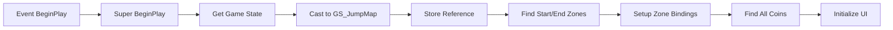
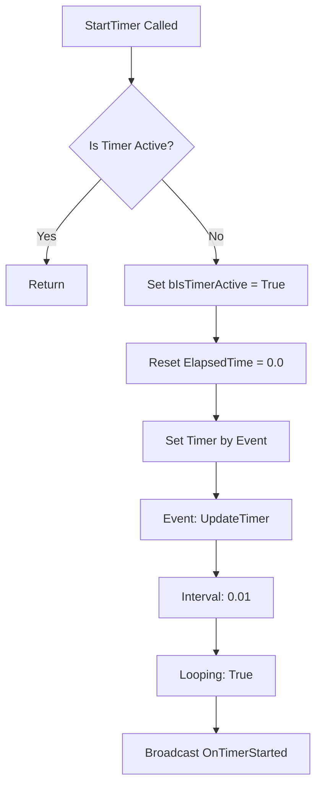

import { Callout, Steps, Tabs, FileTree } from 'nextra/components'
import { Code, Settings, Timer, Trophy } from 'lucide-react'
import { LinkCard } from '@/components/link-card'
import BlueprintExample_New from '@/components/blueprint-example-new'

# 📊 Game Mode & Game State 구현

<Callout type="info" emoji="🎮">
Game Mode는 게임의 규칙을, Game State는 게임의 현재 상태를 관리합니다.
</Callout>

## 1. Game Mode (GM_JumpMap)

### 클래스 생성

<Steps>
### Blueprint 클래스 생성
1. Content Browser에서 우클릭
2. **Blueprint Class** 선택
3. **GameModeBase** 상속
4. 이름: `GM_JumpMap`

### 폴더 구조 설정
```
Content/
├── Blueprints/
│   ├── GameMode/
│   │   └── GM_JumpMap
│   └── GameState/
│       └── GS_JumpMap
```
</Steps>

### 변수 설정

<Tabs items={['Game Settings', 'References', 'Score Settings']}>
  <Tabs.Tab>
```cpp
// === Game Settings ===
TimeBonus: Float = 1000.0          // 시간 보너스 기준점
TimePenaltyRate: Float = 10.0      // 초당 감점
CompletionBonus: Integer = 5000    // 완주 보너스
MaxTime: Float = 300.0              // 제한 시간 (5분)
bIsGameActive: Boolean = False      // 게임 진행 상태
```
  </Tabs.Tab>
  
  <Tabs.Tab>
```cpp
// === References ===
StartZone: BP_StartZone             // 시작 지점 참조
EndZone: BP_EndZone                 // 도착 지점 참조
GameStateRef: GS_JumpMap            // Game State 참조
AllCoins: Array<BP_Coin>            // 모든 코인 목록
CurrentPlayer: Character             // 현재 플레이어
```
  </Tabs.Tab>
  
  <Tabs.Tab>
```cpp
// === Score Settings ===
CoinValue: Integer = 100            // 코인 점수
TimeMultiplier: Float = 2.0         // 시간 점수 배율
PerfectRunBonus: Integer = 10000    // 퍼펙트 보너스
SpeedRunBonus: Integer = 5000       // 스피드런 보너스 (60초 이내)
```
  </Tabs.Tab>
</Tabs>

### Event Graph 구현

#### BeginPlay 이벤트



<Callout type="default" emoji="💡">
**Blueprint 구현 방법**:
1. Event Graph에서 BeginPlay 노드 추가
2. Get Game State 노드 연결
3. Cast to GS_JumpMap으로 타입 변환
4. Get All Actors of Class로 Zone과 Coin 찾기
5. Create Widget으로 HUD 생성
</Callout>

#### StartGame 함수

<BlueprintExample_New
  title="StartGame Function"
  description="게임 시작 로직을 처리하는 함수"
  code={`Function: StartGame
├─ Input: None
├─ Output: None
│
└─ Logic:
    1. Set bIsGameActive = True
    2. Get Player State → Reset Score
    3. Call GameState->StartTimer()
    4. Get Player Controller → Set Input Mode Game Only
    5. Teleport Player to StartZone Location
    6. Play Sound 2D "GameStart"
    7. Update HUD → Show "Game Started!"`}
  nodes={[
    { type: "event", label: "StartGame" },
    { type: "setter", label: "Set bIsGameActive" },
    { type: "function", label: "Reset Player Score" },
    { type: "function", label: "Start Timer" },
    { type: "function", label: "Set Input Mode" },
    { type: "function", label: "Teleport Player" },
    { type: "function", label: "Play Sound 2D" },
    { type: "function", label: "Update HUD" }
  ]}
/>

#### EndGame 함수

<BlueprintExample_New
  title="EndGame Function"
  description="게임 종료 처리를 담당하는 함수"
  code={`Function: EndGame
├─ Input: bCompleted (Boolean)
├─ Output: None
│
└─ Logic:
    1. Call GameState->StopTimer()
    2. Get Final Time from GameState
    3. Call CalculateFinalScore()
    4. Save Game Data
    5. Create Results Widget
    6. Add to Viewport
    7. Set bIsGameActive = False
    8. Play End Sound (Victory/Defeat)`}
  nodes={[
    { type: "function", label: "EndGame", color: "blue" },
    { type: "function", label: "Stop Timer" },
    { type: "getter", label: "Get Final Time" },
    { type: "function", label: "Calculate Final Score" },
    { type: "function", label: "Save Game Data" },
    { type: "function", label: "Create Widget" },
    { type: "function", label: "Add to Viewport" },
    { type: "setter", label: "Set bIsGameActive" },
    { type: "function", label: "Play Sound" }
  ]}
/>

#### CalculateFinalScore 함수

```cpp
Function CalculateFinalScore() -> Integer
{
    // 기본 점수 가져오기
    PlayerState = Get Player State(0)
    CoinScore = PlayerState->CurrentScore
    ElapsedTime = GameState->ElapsedTime
    
    // 시간 점수 계산
    TimeRemaining = MaxTime - ElapsedTime
    TimeScore = TimeRemaining * TimePenaltyRate
    TimeScore = Max(0, TimeScore)  // 음수 방지
    
    // 보너스 계산
    Bonuses = 0
    
    // 퍼펙트런 보너스 (모든 코인 수집)
    if (PlayerState->CoinsCollected == AllCoins.Length)
    {
        Bonuses += PerfectRunBonus
    }
    
    // 스피드런 보너스 (60초 이내)
    if (ElapsedTime < 60.0)
    {
        Bonuses += SpeedRunBonus
    }
    
    // 최종 점수
    FinalScore = CoinScore + TimeScore + Bonuses
    
    return FinalScore
}
```

## 2. Game State (GS_JumpMap)

### 변수 설정

<Tabs items={['Timer Variables', 'Game Statistics', 'Replicated Variables']}>
  <Tabs.Tab>
```cpp
// === Timer Variables ===
ElapsedTime: Float = 0.0            // 경과 시간
BestTime: Float = 999.0             // 최고 기록
bIsTimerActive: Boolean = False     // 타이머 활성 상태
TimerHandle: FTimerHandle            // 타이머 핸들
UpdateFrequency: Float = 0.01        // 업데이트 주기 (100 FPS)
```
  </Tabs.Tab>
  
  <Tabs.Tab>
```cpp
// === Game Statistics ===
TotalCoins: Integer = 0             // 전체 코인 수
CoinsCollected: Integer = 0         // 수집한 코인
PlayersInGame: Integer = 0          // 현재 플레이어 수
CurrentCheckpoint: Integer = 0       // 현재 체크포인트
GamePhase: String = "Waiting"       // 게임 단계
```
  </Tabs.Tab>
  
  <Tabs.Tab>
```cpp
// === Replicated Variables ===
Rep_ElapsedTime: Float (Replicated)      // 동기화된 시간
Rep_GamePhase: String (Replicated)       // 동기화된 게임 단계
Rep_LeaderboardData: Array (Replicated)  // 리더보드 데이터
```

<Callout type="warning" emoji="⚠️">
Replicated 변수는 멀티플레이어 환경에서 모든 클라이언트에 동기화됩니다.
Class Defaults에서 Replication 설정을 확인하세요.
</Callout>
  </Tabs.Tab>
</Tabs>

### 타이머 시스템 구현

#### StartTimer 함수



<BlueprintExample_New
  title="StartTimer Function"
  description="타이머를 시작하고 초기화하는 함수"
  code={`Function: StartTimer
│
├─ Set bIsTimerActive = True
├─ ElapsedTime = 0.0
├─ Set Timer by Event
│   ├─ Event: UpdateTimer
│   ├─ Time: 0.01
│   └─ Looping: True
└─ Event Dispatcher: OnTimerStarted (Broadcast)`}
  nodes={[
    { type: "function", label: "StartTimer", color: "blue" },
    { type: "setter", label: "Set bIsTimerActive" },
    { type: "setter", label: "Set ElapsedTime" },
    { type: "function", label: "Set Timer by Event" },
    { type: "event", label: "Event Dispatcher" }
  ]}
/>

#### UpdateTimer 이벤트

<BlueprintExample_New
  title="UpdateTimer Event"
  description="매 프레임마다 타이머를 업데이트하는 이벤트"
  code={`Custom Event: UpdateTimer
│
├─ Branch: bIsTimerActive?
│   └─ False → Return
│
├─ ElapsedTime += Delta Time (0.01)
│
├─ Call HUD->UpdateTimerDisplay(ElapsedTime)
│
├─ Branch: ElapsedTime > MaxTime?
│   └─ True → Call GameMode->TimeOut()
│
└─ Update Replicated Time (if Multiplayer)
    └─ Rep_ElapsedTime = ElapsedTime`}
  nodes={[
    { type: "event", label: "UpdateTimer", color: "red" },
    { type: "branch", label: "Is Timer Active?" },
    { type: "math", label: "Add Delta Time" },
    { type: "function", label: "Update Timer Display" },
    { type: "branch", label: "Check Time Limit" },
    { type: "setter", label: "Update Replicated Time" }
  ]}
/>

#### StopTimer 함수

```cpp
Function StopTimer() -> Float
{
    // 타이머 비활성화
    bIsTimerActive = False
    
    // 타이머 핸들 정리
    Clear Timer by Handle(TimerHandle)
    
    // 최고 기록 체크
    if (ElapsedTime < BestTime && ElapsedTime > 0)
    {
        BestTime = ElapsedTime
        SaveBestTime()  // 저장
        
        // 새 기록 알림
        ShowNotification("New Record!")
    }
    
    // 최종 시간 반환
    return ElapsedTime
}
```

### Helper 함수들

#### GetFormattedTime

```cpp
Function GetFormattedTime(Time: Float) -> String
{
    Minutes = Floor(Time / 60)
    Seconds = Floor(Time % 60)
    Milliseconds = Floor((Time * 100) % 100)
    
    // 포맷팅: "MM:SS.MS"
    return Format("{0:02}:{1:02}.{2:02}", 
                  Minutes, Seconds, Milliseconds)
}
```

#### ResetGameState

```cpp
Function ResetGameState()
{
    ElapsedTime = 0.0
    CoinsCollected = 0
    CurrentCheckpoint = 0
    GamePhase = "Waiting"
    bIsTimerActive = False
    
    // 모든 코인 리셋
    for (Coin in AllCoins)
    {
        Coin->ResetCoin()
    }
}
```

## 🎮 이벤트 디스패처 설정

### Game Mode 이벤트

<div className="grid grid-cols-1 md:grid-cols-2 gap-4 mt-4">
  <div className="border rounded-lg p-4">
    <h4 className="font-bold mb-2">OnGameStarted</h4>
    <ul className="text-sm space-y-1">
      <li>• 게임 시작 시 호출</li>
      <li>• UI 업데이트 트리거</li>
      <li>• 사운드/이펙트 재생</li>
    </ul>
  </div>
  
  <div className="border rounded-lg p-4">
    <h4 className="font-bold mb-2">OnGameEnded</h4>
    <ul className="text-sm space-y-1">
      <li>• 게임 종료 시 호출</li>
      <li>• 파라미터: bSuccess, FinalScore</li>
      <li>• 결과 화면 표시</li>
    </ul>
  </div>
</div>

### Game State 이벤트

<div className="grid grid-cols-1 md:grid-cols-2 gap-4 mt-4">
  <div className="border rounded-lg p-4">
    <h4 className="font-bold mb-2">OnTimerUpdated</h4>
    <ul className="text-sm space-y-1">
      <li>• 매 프레임 호출 (0.01초)</li>
      <li>• 파라미터: CurrentTime</li>
      <li>• HUD 업데이트용</li>
    </ul>
  </div>
  
  <div className="border rounded-lg p-4">
    <h4 className="font-bold mb-2">OnTimerStopped</h4>
    <ul className="text-sm space-y-1">
      <li>• 타이머 정지 시 호출</li>
      <li>• 파라미터: FinalTime</li>
      <li>• 기록 저장 트리거</li>
    </ul>
  </div>
</div>

## 📝 구현 체크리스트

<Callout type="success" emoji="✅">
**Game Mode 체크리스트**:
- [ ] GM_JumpMap 블루프린트 생성
- [ ] 모든 변수 추가 및 기본값 설정
- [ ] BeginPlay 이벤트 구현
- [ ] StartGame 함수 구현
- [ ] EndGame 함수 구현
- [ ] CalculateFinalScore 함수 구현
- [ ] 이벤트 디스패처 설정
</Callout>

<Callout type="success" emoji="✅">
**Game State 체크리스트**:
- [ ] GS_JumpMap 블루프린트 생성
- [ ] 타이머 변수 설정
- [ ] StartTimer 함수 구현
- [ ] UpdateTimer 이벤트 구현
- [ ] StopTimer 함수 구현
- [ ] GetFormattedTime 헬퍼 함수
- [ ] Replication 설정 (멀티플레이어용)
</Callout>

## 다음 단계

Game Mode와 Game State 구현이 완료되면:

<div className="grid grid-cols-1 md:grid-cols-2 gap-4 mt-4">
  <LinkCard
    title="Player Controller & Player State 구현"
    description="플레이어 제어와 개인 상태 추적 시스템"
    href="/unreal/jumpmap/player-state"
  />
  <LinkCard
    title="게임 액터 구현"
    description="Start Zone, End Zone, Coin 액터 구현"
    href="/unreal/jumpmap/actors"
  />
</div>