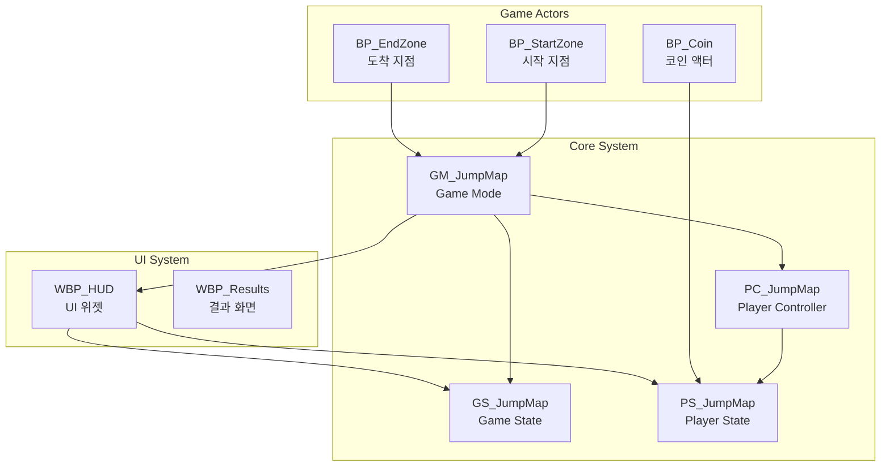
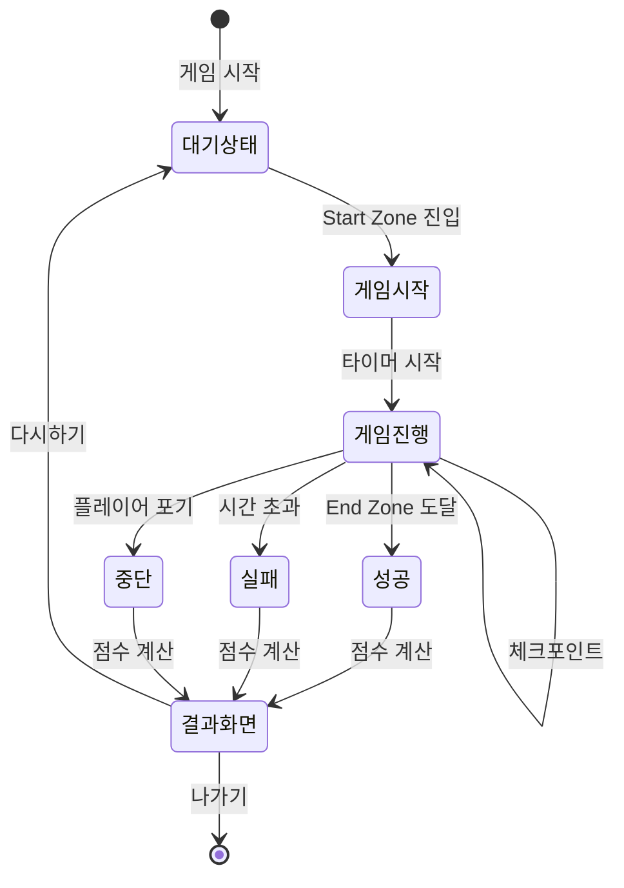

import { Callout, Steps, Tabs, Cards, Card } from 'nextra/components'
import { LinkCard } from '../../../components/LinkCard'

# 🎮 점프맵 게임모드 완전 구현 가이드

<Callout type="info" emoji="🎯">
이 가이드는 언리얼 엔진 5에서 완전한 점프맵 게임 시스템을 구현하는 방법을 단계별로 설명합니다.
</Callout>

## 시스템 구조 개요

점프맵 게임 시스템의 전체 구조와 각 컴포넌트의 역할을 이해합니다.

## 📋 주요 기능

<Cards>
  <Card title="⏱️ 타이머 시스템" href="/unreal/jumpmap/game-mode">
    실시간 타이머와 시간 기반 점수 계산
  </Card>
  <Card title="💰 코인 수집" href="/unreal/jumpmap/actors">
    수집 가능한 코인과 점수 시스템
  </Card>
  <Card title="🏆 점수 시스템" href="/unreal/jumpmap/player-state">
    다양한 보너스와 점수 계산 로직
  </Card>
  <Card title="🎮 게임 플로우" href="/unreal/jumpmap/game-mode">
    시작, 진행, 종료까지의 완전한 게임 사이클
  </Card>
</Cards>

## 🏗️ 시스템 컴포넌트

### 핵심 클래스들

<Tabs items={['Game Mode', 'Game State', 'Player Controller', 'Player State']}>
  <Tabs.Tab>
    **GM_JumpMap** - 게임의 전반적인 규칙과 흐름을 관리
    - 게임 시작/종료 처리
    - 점수 계산 로직
    - 게임 설정 관리
    - Zone 연결 및 관리
  </Tabs.Tab>
  
  <Tabs.Tab>
    **GS_JumpMap** - 게임의 현재 상태를 추적
    - 타이머 관리
    - 게임 통계 추적
    - 리더보드 데이터
    - 멀티플레이어 동기화
  </Tabs.Tab>
  
  <Tabs.Tab>
    **PC_JumpMap** - 플레이어 입력과 제어 관리
    - 입력 처리
    - 카메라 제어
    - UI 상호작용
    - 플레이어 상태 관리
  </Tabs.Tab>
  
  <Tabs.Tab>
    **PS_JumpMap** - 개별 플레이어의 상태 정보
    - 점수 추적
    - 코인 수집 카운트
    - 플레이어 통계
    - 업적 추적
  </Tabs.Tab>
</Tabs>

### 게임 액터들

  

    <h4 className="font-bold mb-2">🚀 BP_StartZone</h4>
    <ul className="text-sm space-y-1">
      <li>• 게임 시작 트리거</li>
      <li>• 플레이어 스폰 위치</li>
      <li>• 시작 이펙트</li>
    </ul>
  

  
  

    <h4 className="font-bold mb-2">🏆 BP_EndZone</h4>
    <ul className="text-sm space-y-1">
      <li>• 게임 완료 트리거</li>
      <li>• 승리 이펙트</li>
      <li>• 최종 점수 계산</li>
    </ul>
  

  
  

    <h4 className="font-bold mb-2">💰 BP_Coin</h4>
    <ul className="text-sm space-y-1">
      <li>• 수집 가능한 아이템</li>
      <li>• 점수 증가</li>
      <li>• 수집 이펙트</li>
    </ul>
  

## 🎯 구현 순서

<Steps>
### 프로젝트 설정
프로젝트 설정에서 게임모드와 관련 클래스들을 설정합니다.

### Game Mode & Game State 구현
게임의 핵심 로직과 상태 관리 시스템을 구현합니다.

### Player Controller & State 구현
플레이어 제어와 개인 상태 추적 시스템을 만듭니다.

### 게임 액터 생성
Start Zone, End Zone, Coin 등의 게임 오브젝트를 만듭니다.

### UI/HUD 시스템 구현
게임 정보를 표시할 UI 위젯을 제작합니다.

### Save System 구현
게임 진행 상황과 최고 기록을 저장하는 시스템을 추가합니다.

### 테스트 및 밸런싱
전체 시스템을 테스트하고 게임 밸런스를 조정합니다.
</Steps>

## 📊 게임 플로우

## 🎮 핵심 게임 메커니즘

### 점수 계산 시스템

<Callout type="default" emoji="📐">
**최종 점수 = 코인 점수 + 시간 점수 + 보너스**

- **코인 점수**: 수집한 코인 × 100점
- **시간 점수**: (제한시간 - 경과시간) × 시간배율
- **보너스**: 퍼펙트런, 스피드런 등 추가 점수
</Callout>

### 타이머 시스템

- **실시간 업데이트**: 0.01초 단위 정밀도
- **UI 동기화**: 밀리초 단위 표시
- **제한 시간**: 기본 5분 (난이도별 조정 가능)

### 수집 시스템

- **코인 수집**: 즉시 점수 반영
- **이펙트 시스템**: 수집 시 시각/청각 피드백
- **선택적 리스폰**: 설정에 따른 재생성

## 🚀 다음 단계

구현을 시작하려면 아래 페이지들을 순서대로 따라하세요:

  <LinkCard
    title="Game Mode & Game State 구현"
    description="게임의 핵심 로직과 상태 관리 시스템"
    href="/unreal/jumpmap/game-mode"
  />
  <LinkCard
    title="Player Controller & State 구현"
    description="플레이어 제어와 개인 상태 추적 시스템"
    href="/unreal/jumpmap/player-state"
  />
  <LinkCard
    title="게임 액터 구현 (Zones & Coins)"
    description="Start Zone, End Zone, Coin 액터 구현"
    href="/unreal/jumpmap/actors"
  />
  <LinkCard
    title="UI/HUD 시스템 구현"
    description="게임 정보 표시와 사용자 인터페이스"
    href="/unreal/jumpmap/ui-system"
  />
  <LinkCard
    title="Save System & 추가 기능"
    description="저장 시스템, 리더보드, 파워업 등"
    href="/unreal/jumpmap/advanced"
  />

<Callout type="success" emoji="✨">
각 페이지는 상세한 블루프린트 구현 방법과 코드 예제를 포함하고 있습니다.
</Callout>