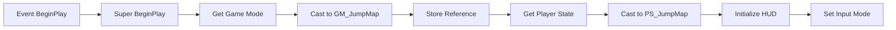
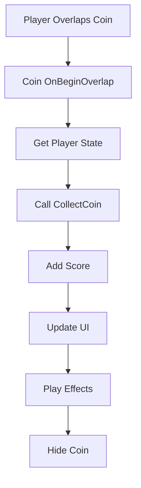

import { Callout, Steps, Tabs, Card } from 'nextra/components'
import { User, Gamepad2, Trophy, BarChart3 } from 'lucide-react'
import { LinkCard } from '@/components/link-card'
import BlueprintExample_New from '@/components/blueprint-example-new'

# 👤 Player Controller & Player State 구현

<Callout type="info" emoji="🎮">
Player Controller는 입력을 관리하고, Player State는 플레이어의 게임 데이터를 저장합니다.
</Callout>

## 1. Player Controller (PC_JumpMap)

### 클래스 생성

<Steps>
### Blueprint 클래스 생성
1. Content Browser에서 우클릭
2. **Blueprint Class** 선택
3. **PlayerController** 상속
4. 이름: `PC_JumpMap`

### 초기 설정
Class Defaults에서:
- **Input Mode**: Game Only
- **Show Mouse Cursor**: False (게임 중)
- **Enable Click Events**: False
</Steps>

### 변수 설정

<Tabs items={['Core Variables', 'UI References', 'Input Settings']}>
  <Tabs.Tab>
```cpp
// === Core Variables ===
GameModeRef: GM_JumpMap              // Game Mode 참조
PlayerStateRef: PS_JumpMap           // Player State 참조
ControlledPawn: Character            // 제어 중인 폰
bIsGamePaused: Boolean = False      // 일시정지 상태
bCanControl: Boolean = True         // 입력 가능 여부
```
  </Tabs.Tab>
  
  <Tabs.Tab>
```cpp
// === UI References ===
HUDWidget: WBP_HUD                  // 메인 HUD
PauseMenuWidget: WBP_PauseMenu      // 일시정지 메뉴
ResultsWidget: WBP_Results          // 결과 화면
CurrentWidget: UserWidget            // 현재 활성 위젯
```
  </Tabs.Tab>
  
  <Tabs.Tab>
```cpp
// === Input Settings ===
MouseSensitivity: Float = 1.0       // 마우스 감도
InvertYAxis: Boolean = False        // Y축 반전
JumpInputBuffer: Float = 0.2        // 점프 입력 버퍼 시간
InputMode: Enum = GameOnly          // 입력 모드
```
  </Tabs.Tab>
</Tabs>

### Event Graph 구현

#### BeginPlay 이벤트



<BlueprintExample_New
  title="BeginPlay Event"
  description="Player Controller 초기화 로직"
  code={`Event BeginPlay
│
├─ Super BeginPlay
│
├─ Get Game Mode → Cast to GM_JumpMap
│   └─ SET GameModeRef
│
├─ Get Player State → Cast to PS_JumpMap
│   └─ SET PlayerStateRef
│
├─ Create HUD Widget
│   ├─ Class: WBP_HUD
│   └─ Add to Viewport (Z-Order: 0)
│
└─ Set Input Mode Game Only
    └─ Flush Input`}
  nodes={[
    { type: "event", label: "BeginPlay", color: "red" },
    { type: "function", label: "Super BeginPlay" },
    { type: "getter", label: "Get Game Mode" },
    { type: "cast", label: "Cast to GM_JumpMap" },
    { type: "getter", label: "Get Player State" },
    { type: "cast", label: "Cast to PS_JumpMap" },
    { type: "function", label: "Create Widget" },
    { type: "function", label: "Add to Viewport" },
    { type: "function", label: "Set Input Mode" }
  ]}
/>

#### Input Actions 설정

<Callout type="default" emoji="🎮">
**Enhanced Input System 사용**:
1. Input Actions 생성 (Content/Input/Actions/)
2. Input Mapping Context 설정
3. Player Controller에 바인딩
</Callout>

##### Jump Input Action

```cpp
// IA_Jump - Jump Input Action
Value Type: Boolean
Triggers: Pressed, Released

// Player Controller에서 처리
Event IA_Jump (Enhanced Input)
│
├─ Triggered
│   └─ Character->Jump()
│
└─ Completed
    └─ Character->StopJumping()
```

##### Pause Input Action

```cpp
// IA_Pause - Pause Game
Event IA_Pause
│
├─ Branch: bIsGamePaused?
│   ├─ True → Resume Game
│   └─ False → Pause Game
│
├─ Toggle Pause State
│   ├─ Set Game Paused
│   ├─ Show/Hide Pause Menu
│   └─ Set Input Mode (UI/Game)
│
└─ Update HUD Visibility
```

### 커스텀 함수들

#### EnablePlayerInput

```cpp
Function EnablePlayerInput(bEnable: Boolean)
{
    bCanControl = bEnable
    
    if (bEnable)
    {
        // 입력 활성화
        Set Input Mode Game Only
        Set Ignore Move Input = False
        Set Ignore Look Input = False
    }
    else
    {
        // 입력 비활성화
        Set Ignore Move Input = True
        Set Ignore Look Input = True
    }
}
```

#### ShowResultScreen

```cpp
Function ShowResultScreen(Score: Integer, Time: Float, bSuccess: Boolean)
{
    // 결과 위젯 생성
    ResultsWidget = Create Widget(WBP_Results)
    
    // 데이터 설정
    ResultsWidget->SetScore(Score)
    ResultsWidget->SetTime(Time)
    ResultsWidget->SetSuccess(bSuccess)
    
    // 화면에 추가
    ResultsWidget->Add to Viewport (Z-Order: 10)
    
    // 입력 모드 변경
    Set Input Mode UI Only
    Set Show Mouse Cursor = True
    
    // 플레이어 입력 비활성화
    EnablePlayerInput(False)
}
```

## 2. Player State (PS_JumpMap)

### 변수 설정

<Tabs items={['Score Variables', 'Player Stats', 'Replicated Data']}>
  <Tabs.Tab>
```cpp
// === Score Variables ===
CurrentScore: Integer = 0           // 현재 점수
CoinsCollected: Integer = 0         // 수집한 코인 수
TimeBonus: Float = 0.0              // 시간 보너스
FinalScore: Integer = 0             // 최종 점수
ScoreMultiplier: Float = 1.0        // 점수 배율
```
  </Tabs.Tab>
  
  <Tabs.Tab>
```cpp
// === Player Stats ===
Deaths: Integer = 0                 // 사망 횟수
Jumps: Integer = 0                  // 점프 횟수
CheckpointsReached: Integer = 0     // 도달한 체크포인트
DistanceTraveled: Float = 0.0       // 이동 거리
PlayTime: Float = 0.0                // 총 플레이 시간
```
  </Tabs.Tab>
  
  <Tabs.Tab>
```cpp
// === Replicated Variables ===
Rep_Score: Integer (Replicated)     // 동기화된 점수
Rep_CoinsCollected: Integer (Rep)   // 동기화된 코인 수
Rep_PlayerName: String (Replicated) // 플레이어 이름
Rep_PlayerRank: Integer (Replicated)// 현재 순위
```
  </Tabs.Tab>
</Tabs>

### 핵심 함수 구현

#### AddScore 함수

<div className="bg-gray-900 rounded-lg p-4 mt-4">
```blueprint
Function: AddScore
├─ Input: Points (Integer)
├─ Output: NewScore (Integer)
│
└─ Logic:
    1. Calculate: Points * ScoreMultiplier
    2. CurrentScore += Calculated Points
    3. Call OnRep_Score() (for UI update)
    4. Broadcast OnScoreChanged Event
    5. Return CurrentScore
```
</div>

#### CollectCoin 함수

```cpp
Function CollectCoin(CoinValue: Integer = 100)
{
    // 코인 카운트 증가
    CoinsCollected++
    
    // 점수 추가
    AddScore(CoinValue)
    
    // 사운드 재생
    Play Sound 2D ("CoinCollect")
    
    // UI 업데이트
    if (HUDWidget)
    {
        HUDWidget->UpdateCoinCounter(CoinsCollected)
    }
    
    // 이벤트 발생
    OnCoinCollected.Broadcast(CoinsCollected)
    
    // 업적 체크
    CheckCoinAchievements()
}
```

#### ResetPlayerStats 함수

```cpp
Function ResetPlayerStats()
{
    // 점수 초기화
    CurrentScore = 0
    CoinsCollected = 0
    TimeBonus = 0.0
    FinalScore = 0
    ScoreMultiplier = 1.0
    
    // 통계 초기화
    Deaths = 0
    Jumps = 0
    CheckpointsReached = 0
    DistanceTraveled = 0.0
    
    // UI 업데이트
    UpdateAllUI()
    
    // 네트워크 동기화
    if (Has Authority)
    {
        OnRep_Score()
        OnRep_CoinsCollected()
    }
}
```

### 이벤트 처리

#### OnRep 함수들 (Replication)

```cpp
// 점수가 동기화될 때
Function OnRep_Score()
{
    // UI 업데이트
    if (HUDWidget)
    {
        HUDWidget->UpdateScore(Rep_Score)
        
        // 점수 애니메이션
        HUDWidget->PlayScoreAnimation()
    }
}

// 코인이 동기화될 때
Function OnRep_CoinsCollected()
{
    // UI 업데이트
    if (HUDWidget)
    {
        HUDWidget->UpdateCoinCounter(Rep_CoinsCollected)
    }
}
```

### 통계 추적 시스템

#### UpdatePlayerStats

```cpp
Function UpdatePlayerStats(DeltaTime: Float)
{
    // 플레이 시간 업데이트
    PlayTime += DeltaTime
    
    // 이동 거리 계산
    if (ControlledPawn)
    {
        CurrentLocation = ControlledPawn->GetActorLocation()
        Distance = (CurrentLocation - LastLocation).Size()
        DistanceTraveled += Distance
        LastLocation = CurrentLocation
    }
    
    // 점프 카운트 (Jump 이벤트에서 호출)
    // 사망 카운트 (Death 이벤트에서 호출)
}
```

## 3. Player Input Mapping

### Enhanced Input 설정

<Steps>
### Input Actions 생성
```
Content/Input/Actions/
├── IA_Move (Vector2D)
├── IA_Look (Vector2D)
├── IA_Jump (Boolean)
├── IA_Sprint (Boolean)
└── IA_Pause (Boolean)
```

### Input Mapping Context 생성
```
Content/Input/
└── IMC_JumpMap
    ├── Move → WASD/Left Stick
    ├── Look → Mouse/Right Stick
    ├── Jump → Space/South Button
    ├── Sprint → Shift/Left Trigger
    └── Pause → Escape/Start Button
```

### Player Controller에 적용
BeginPlay에서:
```cpp
Enhanced Input Subsystem->Add Mapping Context(IMC_JumpMap, Priority: 0)
```
</Steps>

## 4. 플레이어 상호작용 시스템

### 코인 수집 처리



### 체크포인트 시스템

<div className="grid grid-cols-1 md:grid-cols-2 gap-4 mt-4">
  <div className="border rounded-lg p-4">
    <h4 className="font-bold mb-2">체크포인트 도달</h4>
```cpp
Function ReachCheckpoint(CheckpointID: Integer)
{
    if (CheckpointID > CheckpointsReached)
    {
        CheckpointsReached = CheckpointID
        SaveCheckpoint()
        ShowNotification("Checkpoint!")
    }
}
```
  </div>
  
  <div className="border rounded-lg p-4">
    <h4 className="font-bold mb-2">체크포인트 리스폰</h4>
```cpp
Function RespawnAtCheckpoint()
{
    Location = GetCheckpointLocation(CheckpointsReached)
    ControlledPawn->SetActorLocation(Location)
    Deaths++
    AddScore(-100)  // 사망 페널티
}
```
  </div>
</div>

## 📊 데이터 동기화

### 멀티플레이어 고려사항

<Callout type="warning" emoji="⚠️">
**Replication 설정 필수**:
- Player State는 자동으로 Replicated
- Rep_Notify 함수로 클라이언트 UI 업데이트
- Server RPC로 중요한 액션 검증
</Callout>

### Server RPC 함수

```cpp
// 서버에서만 실행
Function ServerCollectCoin(CoinActor: BP_Coin)
{
    // Run on Server, Reliable
    
    if (IsValid(CoinActor) && !CoinActor->bIsCollected)
    {
        // 서버에서 검증
        CollectCoin(CoinActor->CoinValue)
        
        // 모든 클라이언트에 알림
        MulticastCoinCollected(CoinActor)
    }
}

// 모든 클라이언트에서 실행
Function MulticastCoinCollected(CoinActor: BP_Coin)
{
    // Multicast, Reliable
    
    // 시각 효과만 처리
    CoinActor->PlayCollectEffect()
    CoinActor->SetActorHiddenInGame(True)
}
```

## 📝 구현 체크리스트

<Callout type="success" emoji="✅">
**Player Controller 체크리스트**:
- [ ] PC_JumpMap 블루프린트 생성
- [ ] Enhanced Input 설정
- [ ] Input Actions 바인딩
- [ ] Pause 시스템 구현
- [ ] Result Screen 표시 함수
- [ ] 입력 활성화/비활성화 함수
</Callout>

<Callout type="success" emoji="✅">
**Player State 체크리스트**:
- [ ] PS_JumpMap 블루프린트 생성
- [ ] 점수 시스템 변수 설정
- [ ] AddScore 함수 구현
- [ ] CollectCoin 함수 구현
- [ ] 통계 추적 시스템
- [ ] Replication 설정 (멀티플레이어)
- [ ] OnRep 함수들 구현
</Callout>

## 다음 단계

Player Controller와 State 구현이 완료되면:

<div className="grid grid-cols-1 md:grid-cols-2 gap-4 mt-4">
  <LinkCard
    title="게임 액터 구현 (Zones & Coins)"
    description="Start Zone, End Zone, Coin 액터 구현"
    href="/unreal/jumpmap/actors"
  />
  <LinkCard
    title="UI/HUD 시스템"
    description="게임 정보 표시와 사용자 인터페이스"
    href="/unreal/jumpmap/ui-system"
  />
</div>