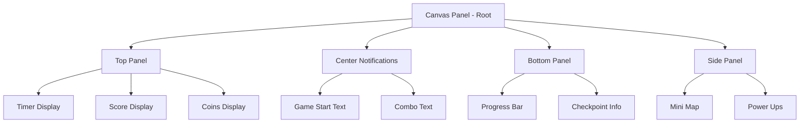

import { Callout, Steps, Tabs, Card } from 'nextra/components'
import { Monitor, Clock, Trophy, Settings } from 'lucide-react'
import { LinkCard } from '@/components/link-card'
import BlueprintExample_New from '@/components/blueprint-example-new'

# 🎨 UI/HUD 시스템 구현

<Callout type="info" emoji="🎮">
게임 정보를 실시간으로 표시하고 플레이어와 상호작용하는 UI 시스템을 구현합니다.
</Callout>

## 1. Main HUD Widget (WBP_HUD)

### 위젯 생성

<Steps>
### Widget Blueprint 생성
1. Content Browser에서 우클릭
2. **User Interface** → **Widget Blueprint**
3. 이름: `WBP_HUD`
4. 폴더: `Content/UI/HUD/`

### 기본 구조 설정
Designer 모드에서:
1. **Canvas Panel** 추가 (루트)
2. **Size Box** 설정 (반응형)
3. **Anchor** 설정 (화면 위치 고정)
</Steps>

### 위젯 구조



### Designer 구현

<Tabs items={['Top Panel', 'Center Notifications', 'Bottom Panel', 'Animations']}>
  <Tabs.Tab>
```xml
<!-- Top Panel Structure -->
[Canvas Panel]
└─ [Horizontal Box] - Top Panel
    ├─ Anchor: Top Center
    ├─ Position: (0, 20)
    ├─ Alignment: 0.5, 0
    
    ├─ [Horizontal Box] - Timer Container
    │   ├─ Padding: (10, 5)
    │   ├─ [Image] - Clock Icon
    │   │   ├─ Size: 32x32
    │   │   └─ Tint: White
    │   └─ [Text Block] - Timer Text
    │       ├─ Name: Text_Timer
    │       ├─ Text: "00:00.00"
    │       ├─ Font Size: 24
    │       └─ Font: Bold
    │
    ├─ [Spacer] - Width: 50
    │
    ├─ [Horizontal Box] - Score Container
    │   ├─ [Image] - Star Icon
    │   └─ [Text Block] - Score Text
    │       ├─ Name: Text_Score
    │       ├─ Text: "0"
    │       └─ Font Size: 24
    │
    └─ [Horizontal Box] - Coins Container
        ├─ [Image] - Coin Icon
        └─ [Text Block] - Coins Text
            ├─ Name: Text_Coins
            ├─ Text: "0/10"
            └─ Font Size: 24
```
  </Tabs.Tab>
  
  <Tabs.Tab>
```xml
<!-- Center Notifications -->
[Canvas Panel]
└─ [Vertical Box] - Center Container
    ├─ Anchor: Center
    ├─ Alignment: 0.5, 0.5
    ├─ Z-Order: 10
    
    ├─ [Text Block] - Main Notification
    │   ├─ Name: Text_MainNotification
    │   ├─ Text: ""
    │   ├─ Font Size: 48
    │   ├─ Shadow Offset: (2, 2)
    │   └─ Visibility: Hidden
    │
    └─ [Text Block] - Combo Display
        ├─ Name: Text_Combo
        ├─ Text: ""
        ├─ Font Size: 36
        ├─ Color: Gold
        └─ Visibility: Hidden
```
  </Tabs.Tab>
  
  <Tabs.Tab>
```xml
<!-- Bottom Panel -->
[Canvas Panel]
└─ [Vertical Box] - Bottom Container
    ├─ Anchor: Bottom Center
    ├─ Position: (0, -50)
    ├─ Alignment: 0.5, 1.0
    
    ├─ [Progress Bar] - Game Progress
    │   ├─ Name: ProgressBar_GameProgress
    │   ├─ Size: (600, 20)
    │   ├─ Percent: 0.0
    │   ├─ Fill Color: Green → Yellow → Red
    │   └─ Background Color: Dark Gray
    │
    └─ [Horizontal Box] - Info Container
        ├─ [Text Block] - Checkpoint Text
        │   ├─ Name: Text_Checkpoint
        │   └─ Text: "Checkpoint: 0/5"
        │
        └─ [Text Block] - Best Time
            ├─ Name: Text_BestTime
            └─ Text: "Best: --:--"
```
  </Tabs.Tab>
  
  <Tabs.Tab>
```xml
<!-- Animations -->
[Animations Panel]
├─ ScorePopup (0.5s)
│   ├─ Scale: 1.0 → 1.3 → 1.0
│   └─ Color: White → Gold → White
│
├─ CoinCollect (0.3s)
│   ├─ Rotation: 0° → 360°
│   └─ Scale: 1.0 → 1.5 → 1.0
│
├─ NotificationFade (2.0s)
│   ├─ 0.0s: Opacity 0, Scale 0.8
│   ├─ 0.2s: Opacity 1, Scale 1.1
│   ├─ 0.3s: Scale 1.0
│   ├─ 1.5s: Opacity 1
│   └─ 2.0s: Opacity 0
│
└─ ComboShake (0.3s)
    ├─ Position: X±5, Y±5
    └─ Scale: 1.0 → 1.2 → 1.0
```
  </Tabs.Tab>
</Tabs>

### Graph (Blueprint Logic)

#### 변수 설정

```cpp
// === References ===
GameModeRef: GM_JumpMap
GameStateRef: GS_JumpMap
PlayerStateRef: PS_JumpMap

// === Display Values ===
CurrentTime: Float = 0.0
CurrentScore: Integer = 0
CurrentCoins: Integer = 0
TotalCoins: Integer = 10

// === Animation Handles ===
ScoreAnimHandle: WidgetAnimation
NotificationHandle: WidgetAnimation
```

#### Event Construct

<div className="bg-gray-900 rounded-lg p-4 mt-4">
```blueprint
Event Construct
│
├─ Get Owning Player
│   └─ Get Player State → Cast to PS_JumpMap
│       └─ SET PlayerStateRef
│
├─ Get Game Mode → Cast to GM_JumpMap
│   └─ SET GameModeRef
│
├─ Get Game State → Cast to GS_JumpMap
│   └─ SET GameStateRef
│
├─ Initialize Display
│   ├─ Set Timer Text "00:00.00"
│   ├─ Set Score Text "0"
│   └─ Set Coins Text "0/0"
│
└─ Bind Events
    ├─ Bind to PlayerState->OnScoreChanged
    ├─ Bind to PlayerState->OnCoinCollected
    └─ Bind to GameState->OnTimerUpdated
```
</div>

#### Update Functions

##### UpdateTimer

```cpp
Function UpdateTimer(Time: Float)
{
    // 시간 포맷팅
    Minutes = Floor(Time / 60)
    Seconds = Floor(Time % 60)
    Milliseconds = Floor((Time * 100) % 100)
    
    // 텍스트 설정
    TimeString = Format("{0:02}:{1:02}.{2:02}", 
                       Minutes, Seconds, Milliseconds)
    Text_Timer->SetText(TimeString)
    
    // 시간 경고 (남은 시간 30초 이하)
    if (GameMode->MaxTime - Time <= 30.0)
    {
        // 빨간색으로 변경 + 깜빡임
        Text_Timer->SetColorAndOpacity(Red)
        Play Animation (TimerWarning)
    }
}
```

##### UpdateScore

```cpp
Function UpdateScore(NewScore: Integer)
{
    // 점수 차이 계산
    ScoreDiff = NewScore - CurrentScore
    
    // 애니메이션 재생
    if (ScoreDiff > 0)
    {
        Play Animation (ScorePopup)
        
        // 점수 증가 표시
        ShowFloatingText("+{0}", ScoreDiff)
    }
    
    // 텍스트 업데이트
    Text_Score->SetText(ToString(NewScore))
    CurrentScore = NewScore
    
    // 마일스톤 체크
    if (NewScore % 1000 == 0 && NewScore > 0)
    {
        ShowNotification("MILESTONE: {0} POINTS!", NewScore)
    }
}
```

##### UpdateCoins

```cpp
Function UpdateCoins(CollectedCoins: Integer)
{
    // 텍스트 업데이트
    Text_Coins->SetText("{0}/{1}", CollectedCoins, TotalCoins)
    
    // 애니메이션
    Play Animation (CoinCollect)
    
    // 완료 체크
    if (CollectedCoins >= TotalCoins)
    {
        Text_Coins->SetColorAndOpacity(Gold)
        ShowNotification("ALL COINS COLLECTED!")
    }
}
```

### Notification System

```cpp
Function ShowNotification(Message: String, Duration: Float = 2.0)
{
    // 메인 알림 텍스트 설정
    Text_MainNotification->SetText(Message)
    Text_MainNotification->SetVisibility(Visible)
    
    // 애니메이션 재생
    Play Animation (NotificationFade)
    
    // 타이머로 숨기기
    Set Timer by Function Name
    ├─ Function: HideNotification
    ├─ Time: Duration
    └─ Looping: False
}

Function HideNotification()
{
    Text_MainNotification->SetVisibility(Hidden)
}
```

## 2. Results Widget (WBP_Results)

### 위젯 구조

<div className="bg-gray-900 rounded-lg p-4 mt-4">
```xml
[Canvas Panel]
└─ [Border] - Background
    ├─ Brush Color: (0,0,0,0.8)
    └─ [Vertical Box] - Main Container
        ├─ Padding: 50
        ├─ Alignment: Center
        
        ├─ [Text] - Title
        │   ├─ Text: "LEVEL COMPLETE!"
        │   └─ Font Size: 48
        │
        ├─ [Horizontal Box] - Stats Container
        │   ├─ [Vertical Box] - Labels
        │   │   ├─ "Time:"
        │   │   ├─ "Score:"
        │   │   ├─ "Coins:"
        │   │   └─ "Grade:"
        │   │
        │   └─ [Vertical Box] - Values
        │       ├─ Text_FinalTime
        │       ├─ Text_FinalScore
        │       ├─ Text_FinalCoins
        │       └─ Text_Grade
        │
        ├─ [Progress Bar] - Score Bar
        │   └─ Visual score representation
        │
        └─ [Horizontal Box] - Buttons
            ├─ [Button] - Retry
            │   └─ Text: "RETRY"
            └─ [Button] - Main Menu
                └─ Text: "MAIN MENU"
```
</div>

### Grade Calculation

```cpp
Function CalculateGrade(Score: Integer, Time: Float) -> String
{
    // S Grade: Perfect Run
    if (Score >= 15000 && Time < 60.0)
        return "S"
    
    // A Grade: Excellent
    if (Score >= 10000 && Time < 90.0)
        return "A"
    
    // B Grade: Good
    if (Score >= 7500 && Time < 120.0)
        return "B"
    
    // C Grade: Average
    if (Score >= 5000 && Time < 180.0)
        return "C"
    
    // D Grade: Below Average
    if (Score >= 2500)
        return "D"
    
    // F Grade: Poor
    return "F"
}
```

## 3. Pause Menu Widget (WBP_PauseMenu)

### 구조

```xml
[Canvas Panel]
└─ [Background Blur]
    └─ [Vertical Box] - Menu Container
        ├─ [Text] - "PAUSED"
        │
        ├─ [Button] - Resume
        ├─ [Button] - Restart
        ├─ [Button] - Settings
        └─ [Button] - Quit
```

### Button Events

```cpp
// Resume Button
OnClicked (Button_Resume)
{
    PlayerController->SetPause(False)
    Remove from Parent
    Set Input Mode Game Only
}

// Restart Button
OnClicked (Button_Restart)
{
    GameMode->RestartGame()
    Remove from Parent
}

// Settings Button
OnClicked (Button_Settings)
{
    Create Widget (WBP_Settings)
    Add to Viewport
}
```

## 4. Additional UI Elements

### Combo System

<div className="border rounded-lg p-4">
```cpp
Function ShowCombo(ComboCount: Integer)
{
    if (ComboCount > 1)
    {
        Text_Combo->SetText("x{0} COMBO!", ComboCount)
        Text_Combo->SetVisibility(Visible)
        
        // 크기와 색상 애니메이션
        Play Animation (ComboShake)
        
        // 콤보 레벨별 색상
        if (ComboCount >= 10)
            Text_Combo->SetColorAndOpacity(Gold)
        else if (ComboCount >= 5)
            Text_Combo->SetColorAndOpacity(Orange)
        else
            Text_Combo->SetColorAndOpacity(White)
        
        // 3초 후 숨기기
        Set Timer (3.0) → Hide Combo
    }
}
```
</div>

### Floating Damage/Score

<div className="border rounded-lg p-4">
```cpp
Widget: WBP_FloatingText
│
├─ Properties:
│   ├─ DisplayText: String
│   ├─ TextColor: Color
│   └─ Duration: Float = 1.0
│
└─ Animation:
    ├─ Move Up: Z + 100 over 1 second
    ├─ Fade Out: Opacity 1 → 0
    └─ Scale: 1.0 → 0.8
```
</div>

## 5. UI Manager

### UI 관리 시스템

```cpp
// PC_JumpMap에서 UI 관리
Function CreateAllWidgets()
{
    // HUD 생성
    HUDWidget = Create Widget(WBP_HUD)
    HUDWidget->Add to Viewport(0)
    
    // Pause Menu (생성만, 표시 X)
    PauseMenuWidget = Create Widget(WBP_PauseMenu)
    
    // Results (생성만, 표시 X)
    ResultsWidget = Create Widget(WBP_Results)
}

Function ShowWidget(WidgetType: Enum)
{
    switch (WidgetType)
    {
        case HUD:
            HUDWidget->SetVisibility(Visible)
            break
            
        case PauseMenu:
            PauseMenuWidget->Add to Viewport(10)
            Set Input Mode UI Only
            break
            
        case Results:
            ResultsWidget->Add to Viewport(20)
            HUDWidget->SetVisibility(Hidden)
            break
    }
}
```

## 📱 반응형 UI 설정

### Screen Size 대응

```cpp
// Anchor 설정 예시
Timer Display:
  Anchor: Top Left
  Alignment: (0, 0)
  Position: (20, 20)

Score Display:
  Anchor: Top Center
  Alignment: (0.5, 0)
  Position: (0, 20)

Coin Counter:
  Anchor: Top Right
  Alignment: (1, 0)
  Position: (-20, 20)
```

### DPI Scaling

<Callout type="info" emoji="📐">
**Project Settings → User Interface**:
- DPI Scale Rule: Shortest Side
- DPI Curve: 1080p = 1.0 scale
</Callout>

## 📝 구현 체크리스트

<Callout type="success" emoji="✅">
**Main HUD 체크리스트**:
- [ ] WBP_HUD 위젯 생성
- [ ] 타이머 디스플레이 구현
- [ ] 점수 시스템 UI
- [ ] 코인 카운터 구현
- [ ] 알림 시스템
- [ ] 애니메이션 설정
</Callout>

<Callout type="success" emoji="✅">
**Results Screen 체크리스트**:
- [ ] WBP_Results 위젯 생성
- [ ] 점수 계산 및 표시
- [ ] 등급 시스템 구현
- [ ] 버튼 이벤트 처리
- [ ] 애니메이션 전환
</Callout>

<Callout type="success" emoji="✅">
**Additional UI 체크리스트**:
- [ ] Pause Menu 구현
- [ ] Settings 화면
- [ ] Floating Text 시스템
- [ ] Combo Display
- [ ] 반응형 UI 설정
</Callout>

## 다음 단계

UI/HUD 시스템 구현이 완료되면:

<LinkCard
  title="Save System & 추가 기능"
  description="저장 시스템, 리더보드, 파워업 등 고급 기능 구현"
  href="/unreal/jumpmap/advanced"
/>

완료 후 전체 시스템 테스트 및 밸런싱을 진행하세요.